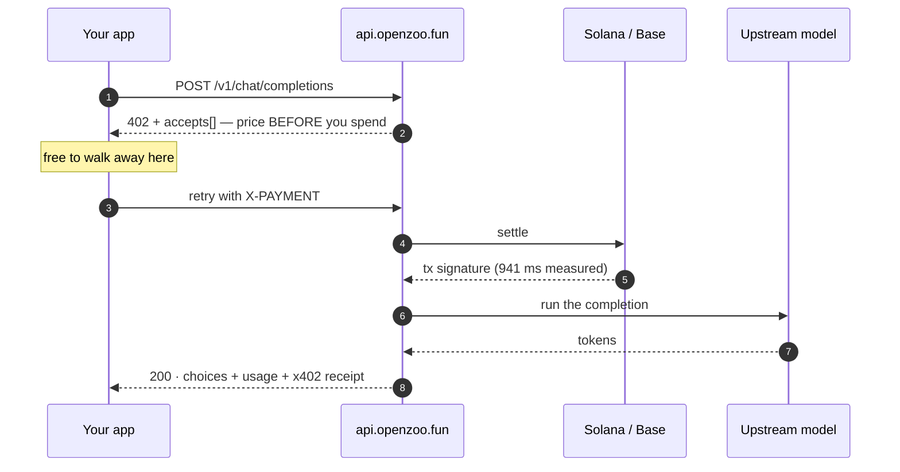
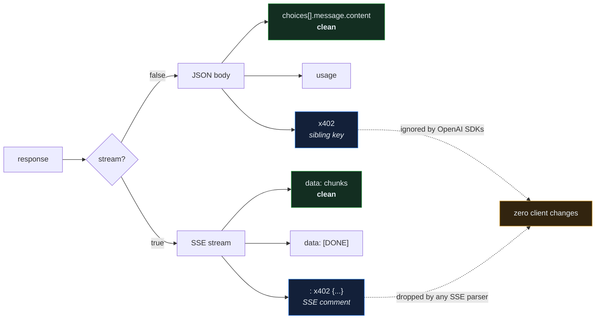
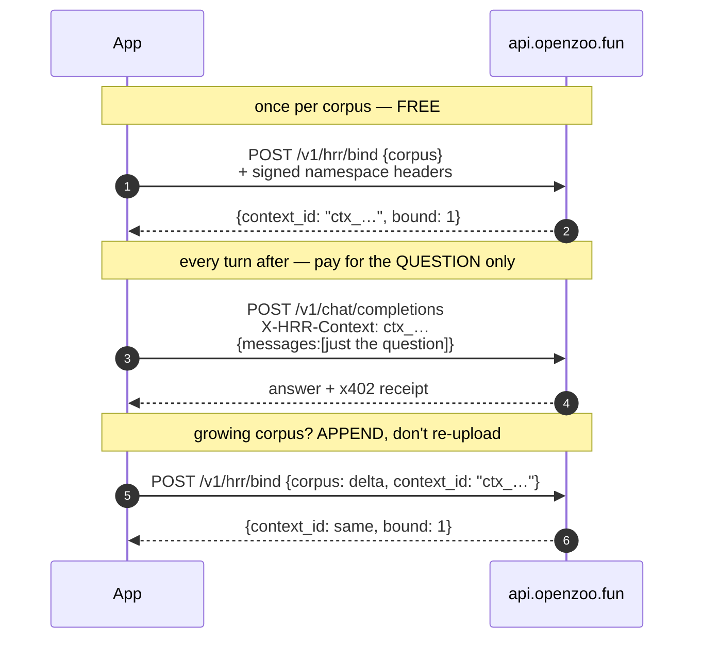
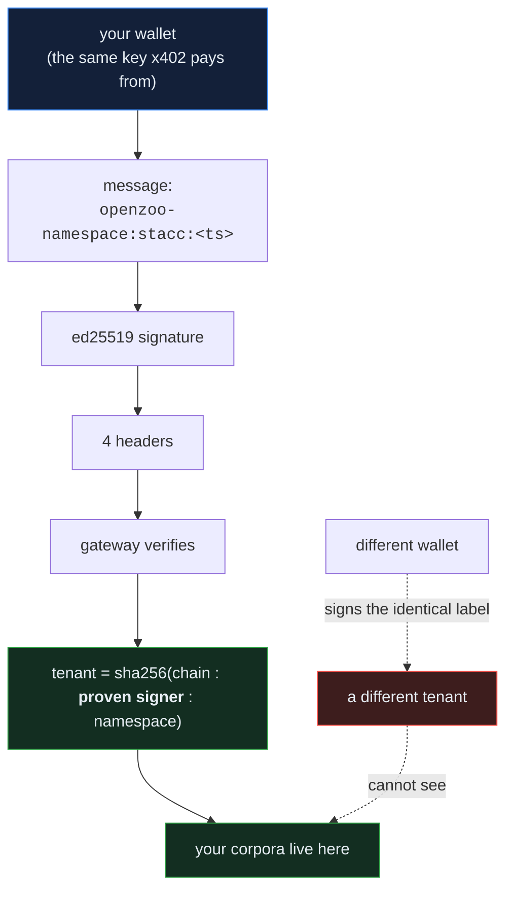
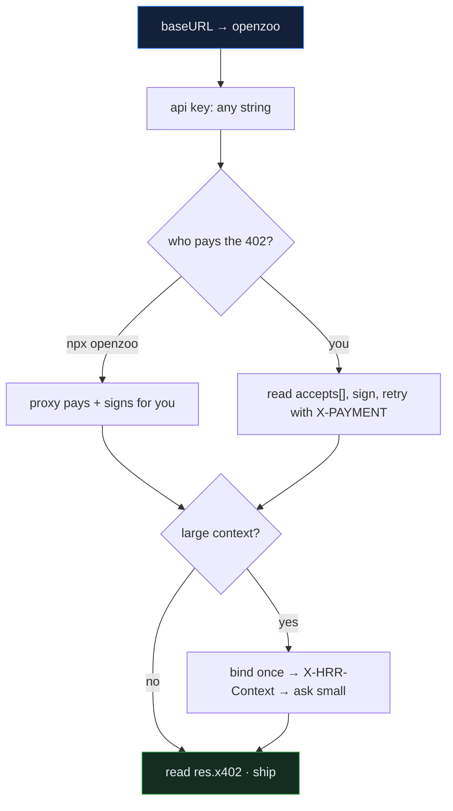

# Integrating openzoo

OpenAI-compatible inference with **no signup and no API key**. Every call is priced
before it runs and paid per request over [x402](https://x402.org).

Two things surprise people, so they're answered first:

1. **Receipts never touch the message.** They ride as a sibling JSON key, or an SSE comment.
2. **Ownership is proven by signature, not asserted by a header.** Your corpus is keyed to a wallet you control.

---

## Part 1 — Calls

### The flow



Quoting is free and unlimited. Only a completed call costs anything.

### Where the receipt lands



### The quote — free, no key

```bash
curl -s -X POST https://api.openzoo.fun/v1/chat/completions \
  -H "Content-Type: application/json" \
  -d '{"model":"gemini-2.5-flash","messages":[{"role":"user","content":"hi"}],"max_tokens":20}'
```

```json
{
  "x402Version": 1,
  "accepts": [
    {
      "scheme": "exact",
      "network": "solana:5eykt4UsFv8P8NJdTREpY1vzqKqZKvdp",
      "asset": "EPjFWdd5AufqSSqeM2qN1xzybapC8G4wEGGkZwyTDt1v",
      "maxAmountRequired": "479",
      "payTo": "WzMaL78srutrF6CsxEkWuhMaDF5HZA6jNRaEPengqpb",
      "resource": "https://api.openzoo.fun/v1/chat/completions",
      "description": "google/gemini-2.5-flash — ceiling; reconciled to actual cost after the call",
      "maxTimeoutSeconds": 120,
      "extra": {
        "facilitator": "https://x402.accrue.fund",
        "symbol": "USDC",
        "decimals": 6,
        "billedUsd": 0.0004786,
        "directUsd": 0.0004786,
        "savesVsDirect": 1,
        "pricedAt": "2026-09-03T04:00:56.644Z"
      }
    }
  ]
}
```

Several rows come back — USDC plus project tokens on Solana and Base. Pay with
whichever you already hold; `maxAmountRequired` is denominated per asset.

### The completion — receipt as a sibling key

```json
{
  "id": "BPGYas7PBbiV_uMPqdvj-AM",
  "object": "chat.completion",
  "model": "gemini-2.5-flash",
  "choices": [
    { "index": 0, "message": { "role": "assistant", "content": "Hello" }, "finish_reason": "length" }
  ],
  "usage": { "prompt_tokens": 220, "completion_tokens": 1, "cost": 0.00026786959167234643 },
  "x402": {
    "billedUsd": 0.00026786959167234643,
    "directUsd": 0.0005069,
    "savesVsDirect": 1.8923387191332697,
    "cogsUsd": 0.003307,
    "settle": {
      "success": true,
      "transaction": "8LL7VyoyY5tjxH7i8j96m2yhpdpm9oWSEpKDkceFbDdBNDTJ2xq4z8EPomjcRzpwJEKhAezRbJ9Xyb8puwDMymK",
      "payer": "HLyPVoGK3yxkUoCybWQiHXETEPA8KxPdpQ1Q9pVGGhku",
      "network": "solana:5eykt4UsFv8P8NJdTREpY1vzqKqZKvdp",
      "settleMs": 941
    },
    "lecore": { "engaged": false, "reason": "under spill threshold" }
  }
}
```

`content` is `"Hello"`. Nothing about money is in it.

### Streaming — receipt as an SSE comment

```
data: {"object":"chat.completion.chunk","choices":[{"delta":{"role":"assistant"}}]}

data: {"object":"chat.completion.chunk","choices":[{"delta":{},"finish_reason":"stop"}]}

data: [DONE]

: x402 {"billedUsd":0.0002746861042450296,"directUsd":0.00047950,"savesVsDirect":1.7456,"cogsUsd":0.003306}
```

Lines beginning `:` are comments in the SSE spec. Every compliant parser drops them.

### Reading the receipt

| field | meaning |
|---|---|
| `billedUsd` | what you actually paid for this call |
| `directUsd` | what the same request would have cost buying direct |
| `savesVsDirect` | `directUsd / billedUsd`; `1` when there is nothing to claim |
| `cogsUsd` | what the upstream charged us, so margin is checkable rather than claimed |
| `settle.transaction` | on-chain signature — verify it yourself |
| `settle.settleMs` | settlement latency |
| `lecore.engaged` | whether context binding compressed this request |

> **Honest caveat.** In the sample above `cogsUsd` ($0.0033) exceeds `billedUsd`
> ($0.00027) — short calls with nothing bound can run at a loss for us. The pricing
> law is *cost plus a share of the saving*, so the multiple is real where savings
> exist: long, context-heavy sessions, which is exactly where binding kicks in.

---

## Part 2 — Corpora: bind once, ask cheaply

Re-sending a large context on every turn is what makes agent loops expensive.
Bind it **once**, get a `context_id`, then send only the question.



Passing `context_id` to `/v1/hrr/bind` **appends** to that context. That is the
difference between paying for the delta and paying for the whole transcript again
on every turn.

### Proving ownership — sign, don't assert

A header you merely *assert* is not authentication: anyone who knows your wallet
address could send the same string. So the gateway **requires a signature** and
derives your tenant from the *proven* signer:



Nothing leaves your machine but a public key and a signature. The timestamp is
minted per call and bounds replay, so these headers are deliberately **not** cached.

| header | value |
|---|---|
| `x-openzoo-namespace` | `stacc` (which of your namespaces you mean) |
| `x-openzoo-namespace-sig` | base58 ed25519 signature over `openzoo-namespace:<ns>:<ts>` |
| `x-openzoo-namespace-signer` | base58 public key |
| `x-openzoo-namespace-ts` | `Date.now()` as a string |
| `x-openzoo-namespace-chain` | `solana` |

### Signing it yourself

A Solana secret key is `seed || pubkey`; Node signs ed25519 from a PKCS8 wrapper
around the 32-byte seed:

```js
import crypto from "node:crypto";

const PKCS8 = Buffer.from("302e020100300506032b657004220420", "hex");
const B58 = "123456789ABCDEFGHJKLMNPQRSTUVWXYZabcdefghijkmnopqrstuvwxyz";
const b58 = (b) => { let d=[0]; for (const x of b) { let c=x;
  for (let i=0;i<d.length;i++){c+=d[i]<<8;d[i]=c%58;c=(c/58)|0}
  while(c){d.push(c%58);c=(c/58)|0} }
  let s=""; for (const x of b) { if (x===0) s+="1"; else break }
  return s + d.reverse().map(i=>B58[i]).join(""); };

export function namespaceHeaders(secretKey, namespace = "stacc") {
  const der = Buffer.concat([PKCS8, Buffer.from(secretKey.slice(0, 32))]);
  const key = crypto.createPrivateKey({ key: der, format: "der", type: "pkcs8" });
  const ts  = String(Date.now());
  const sig = crypto.sign(null, Buffer.from(`openzoo-namespace:${namespace}:${ts}`), key);
  return {
    "content-type": "application/json",
    "x-openzoo-namespace": namespace,
    "x-openzoo-namespace-sig": b58(sig),
    "x-openzoo-namespace-signer": b58(secretKey.slice(32, 64)), // the pubkey half
    "x-openzoo-namespace-ts": ts,
    "x-openzoo-namespace-chain": "solana",
  };
}
```

Bind, then ask:

```js
// 1. bind once — free
const bind = await fetch("https://api.openzoo.fun/v1/hrr/bind", {
  method: "POST",
  headers: namespaceHeaders(secretKey),
  body: JSON.stringify({ corpus: entireDocument }),
}).then(r => r.json());
// → { object: "hrr.bind", context_id: "ctx_01M1JQ198Y8CM2AXEG240795WB", bound: 1 }

// 2. ask, sending only the question
const answer = await fetch("https://api.openzoo.fun/v1/chat/completions", {
  method: "POST",
  headers: { ...namespaceHeaders(secretKey), "X-HRR-Context": bind.context_id },
  body: JSON.stringify({
    model: "gemini-2.5-flash",
    messages: [{ role: "user", content: "what does section 4 say about refunds?" }],
  }),
});

// 3. append later — same context_id, only the new text
await fetch("https://api.openzoo.fun/v1/hrr/bind", {
  method: "POST",
  headers: namespaceHeaders(secretKey),
  body: JSON.stringify({ corpus: newChapter, context_id: bind.context_id }),
});
```

### The boundary, measured

Two fresh keys, the same corpus text, against the live gateway:

| test | result |
|---|---|
| signer **A** binds | `200` → `ctx_01M1JQ1WWWHWCBN92SQP5WABAW` |
| signer **B** binds the *identical* corpus | `200` → `ctx_01M1JQ1X07GWK47D2BGV7CBEV2` (different context) |
| **B** tries to append into **A**'s context | `404 {"error":"unknown context_id","code":"context_not_found"}` |
| unsigned request, namespace merely asserted | `200`, but lands in the **shared** tenant |

That last row is the one to design around: an unsigned bind still succeeds, it just
goes somewhere public where the id is the only thing protecting it. **Sign every
request.** Corpora bound unsigned are not reachable from a signed one.

### Watch the size you actually bound

A bind of a truncated read *succeeds* and looks identical to a real one. Check the
returned byte/chunk count against the real size of what you meant to send — a 400 KB
document that binds as 500 characters is the single most common integration bug,
and it fails silently forever after.

---

## Wiring it up

### Any OpenAI SDK

```ts
import OpenAI from "openai";

const client = new OpenAI({
  baseURL: "https://api.openzoo.fun/v1", // or http://localhost:8402/v1
  apiKey: "sk-openzoo",                  // any value; there are no accounts
});

const res = await client.chat.completions.create({
  model: "gemini-2.5-flash",
  messages: [{ role: "user", content: "hi" }],
});

const receipt = (res as any).x402;       // the SDK ignores it; you can read it
console.log(receipt.billedUsd, receipt.settle.transaction);
```

### Local proxy — pays automatically, signs automatically

```bash
npx openzoo      # http://localhost:8402/v1
```

It holds the wallet, performs the 402 handshake, signs the namespace on every
request, and forwards a clean OpenAI response. Point any OpenAI-compatible tool
at it and you implement none of the above.

### LangChain

```bash
pip install langchain-openzoo
```

```python
from langchain_openzoo import ChatOpenZoo
llm = ChatOpenZoo(model="gemini-2.5-flash")
```

### Free model list

```bash
curl https://api.openzoo.fun/v1/models
```

---

## Checklist



- [ ] `baseURL` → `https://api.openzoo.fun/v1` or `http://localhost:8402/v1`
- [ ] API key → any non-empty string (`sk-openzoo` by convention)
- [ ] Payment → `npx openzoo`, or implement the x402 handshake yourself
- [ ] Sign the namespace headers on **every** request, or accept the shared tenant
- [ ] Large context → bind once, pass `X-HRR-Context`, append deltas
- [ ] Verify the bound size matches what you meant to send
- [ ] Receipts → `res.x402` (buffered) or the `: x402` SSE comment (streaming)
- [ ] Nothing to change in prompt handling, message parsing, or streaming logic

---

MIT · [openzoo.fun](https://openzoo.fun) · [@openzoobot](https://x.com/openzoobot)
